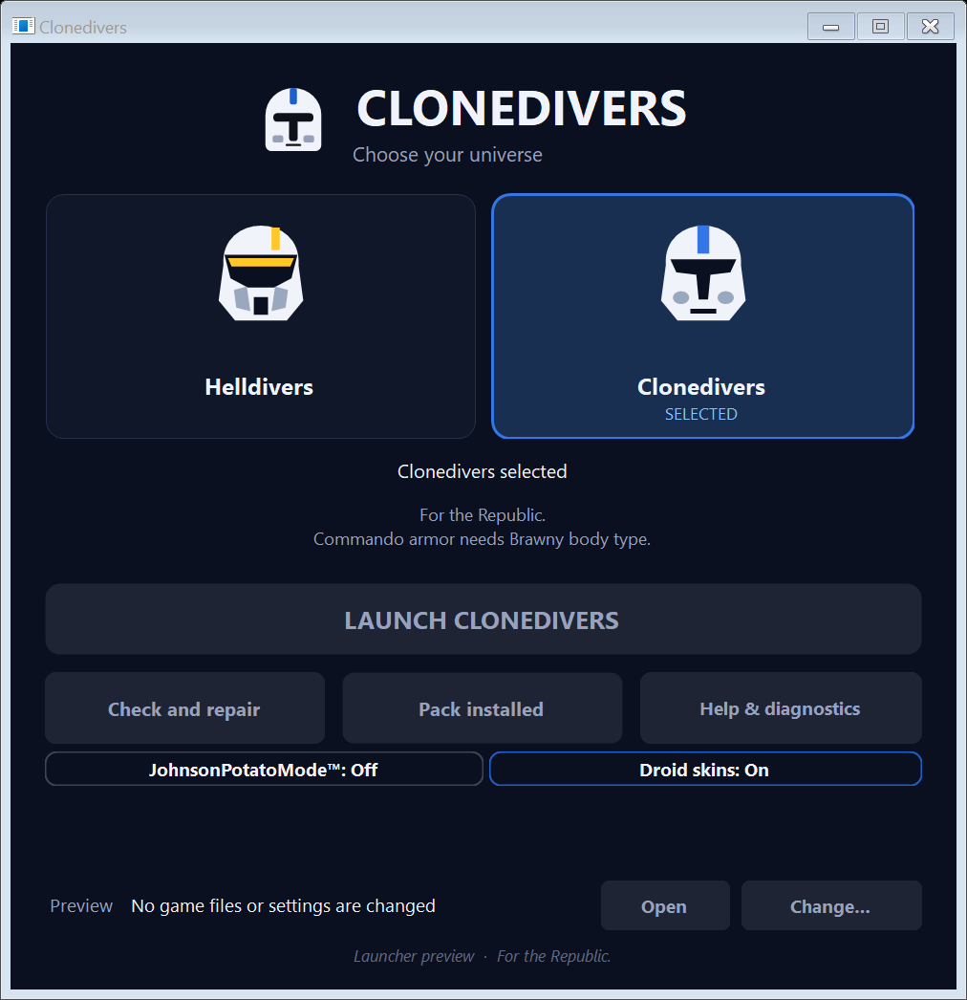

<p align="center"></p>

<p align="center"><b>Clones and commandos, together.</b><br>
Choose Helldivers for the original game or Clonedivers for the squad pack. Launch through Steam.</p>

<p align="center"><a href="https://github.com/owendavidgoode/clonedivers/releases/latest/download/Clonedivers.exe"></a></p>
<p align="center">Windows 10/11 64-bit · Steam copy of Helldivers 2 · no separate runtime needed</p>
<p align="center"></p>

## Get started

1. Download [Clonedivers.exe](https://github.com/owendavidgoode/clonedivers/releases/latest/download/Clonedivers.exe). Close any older launcher before replacing it. The executable is unsigned; Windows may show a SmartScreen prompt.
2. Keep the game closed. Choose **Clonedivers**, set **Droid skins** and **JohnsonPotatoMode™**, then download the pack. The launcher shows the download size and resumes interrupted downloads.
3. Click **Launch**. Steam starts Helldivers 2. Each player installs the pack locally to see and hear its replacements.

Current release: **launcher 1.6.0 / pack 2026.09.24-r10**. Existing players should update the launcher first, then **Update pack**. Unchanged downloads are reused. [Release notes](docs/releases/v1.6.0.md) cover the changes and remaining gameplay checks.

**Vanilla night?** Choose **Helldivers** while the game is closed. It parks the mods and hides mod options. Cached mode changes don't ask for confirmation. **Check and repair** verifies installed files while preserving the selected mode.

**JohnsonPotatoMode™** streams full-detail textures as needed. It replaces the old Lighter textures selector; it does not lower texture resolution or guarantee more FPS. Choose it before the first download to avoid downloading both profiles.

## What's included

Clone and Commando armor share one roster, with more clone colors and clearer English equipment names. Delta Squad voices and the opening are always included. **Commando bodies require Brawny**; choose your voice separately. See [team setup and equipment](docs/TEAM-SETUP.md).

The pack includes clone blasters with repaired ADS scopes, Republic weapon and ship audio, Venators, LAATs, a Y-Wing, AT-TE exosuits, TX-130 vehicles, the Falchion Bastion, and optional droid skins. MTT cannons and spider-droid weapons are restored when using the relevant droid replacements. Eye/vent markers remain unfinished.

The **Supply FRV mesh port** and **Watcher probe-audio loop** are experimental and included at Owen's request. Guard Dog probe chatter is removed. Vehicle seating, supply access, deformation/destruction and Watcher loop behavior still need squad testing. The AT-TE camera is unchanged; the rejected cutaway and camera loader/probe are excluded.

[Mod credits and source pages](docs/MODS.md), [armor follow-up](docs/PLAYER-QA-FOLLOWUP.md), [vehicle sources](docs/VEHICLES-AND-CLIENT-LOGGING.md), and [7.1 compatibility audit](docs/HD2-7.1-COMPATIBILITY.md) document the underlying work. Startup passed on build 25480438 (7.1.1); the 65 rebased audio banks, Watcher bank and English text are unchanged from the audited 7.1 bases. This is not a claim that every asset has passed gameplay testing.

## Reports and troubleshooting

**Help & diagnostics → Save report** exports hardware, settings and recent launcher/session observations. Optional **Performance sharing** needs a squad invitation and one-time setup. Leave the launcher open while playing to record sessions. Sharing is off until enrolled; [collection details](docs/AUTOMATIC-PERFORMANCE-REPORTS.md) explain the data and retention.

- Keep the game closed while switching or updating. The launcher refuses changes while the game is running.
- After a game update, follow the compatibility warning until the pack has been checked. Steam's integrity check repairs original files but does not remove mods.
- If an update is interrupted, use **Finish update** with the game closed. Use **Check and repair** for missing or damaged pack files.
- Repeated GameGuard startup failures may require a Windows restart. Avoid repeated launches or changing protection settings. [Our investigation](docs/GAMEGUARD-INVESTIGATION.md) has not established the internal cause of error 114.
- Steam sometimes retains **Running** after the game has exited. This has also happened with manually started Steam and remains unresolved.
- Allow space for the shown download and replaced files. The launcher keeps replaced mods in `mods_old` for recovery.

## How it works

The launcher installs SHA-256-verified `*.patch_*` assets in the game's `data` folder. Helldivers mode parks them in `mods_off`; mode and profile changes reuse matching content. It reads the versioned update feed and opens `steam://rungameid/553850` to launch. It does not patch the original game executable or inject a camera hook. FOV remains a personal game setting.

## Development

Build with the [.NET 8 SDK](https://dotnet.microsoft.com/download/dotnet/8.0). Fetch the pinned PresentMon dependency with `tools/fetch-presentmon.ps1`, then:

```powershell
dotnet publish -c Release Clonedivers
dotnet run --project Clonedivers.Tests
```

See [development notes](docs/DEVELOPING.md) and the [verified release workflow](docs/PUBLISHING.md).

## Credits and license

[MIT](LICENSE) for Clonedivers itself. Community mods belong to their credited authors. PresentMon's license is bundled in the launcher. Helldivers 2 is Arrowhead Game Studios / Sony Interactive Entertainment; Star Wars is Lucasfilm. Fan utility, not affiliated with them.
