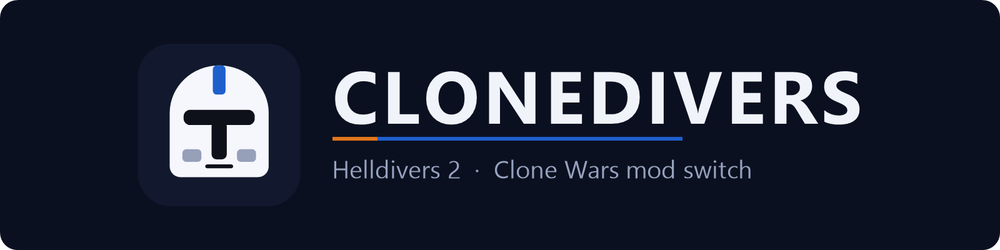
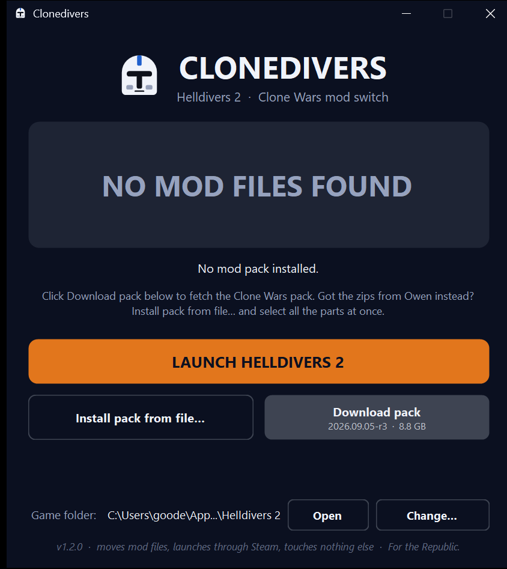
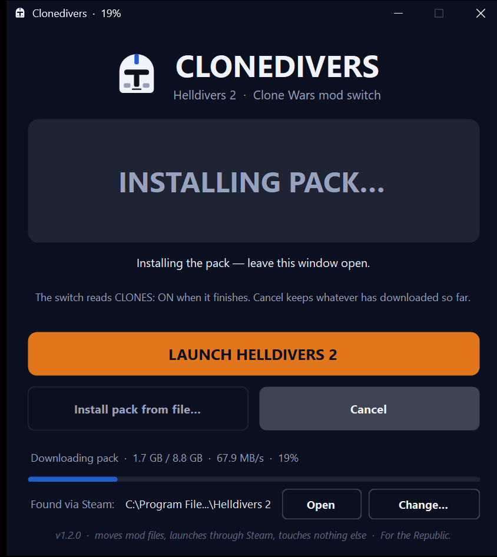
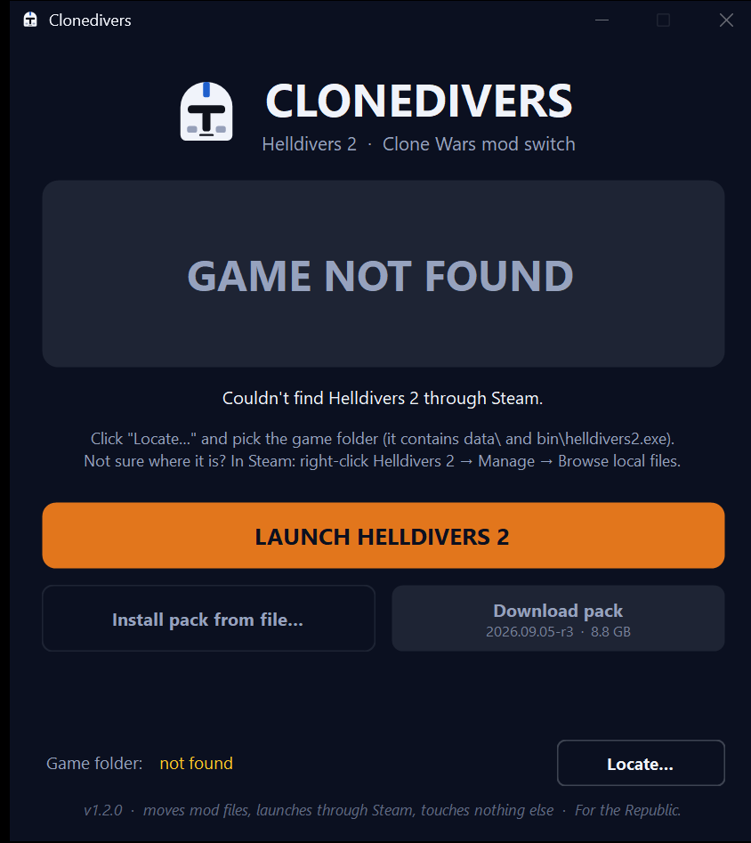
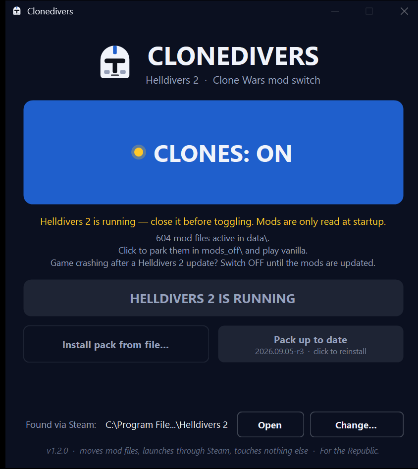

<p align="center"></p>

<p align="center"><b>One exe, one button: Helldivers 2 becomes the Clone Wars.</b><br>
Clonedivers installs the mod pack, switches it on or off, and launches the game. No installer, no accounts, no background service, nothing touches the game itself.</p>

<p align="center">
  <a href="https://github.com/owendavidgoode/clonedivers/releases/latest/download/Clonedivers.exe"></a>
</p>
<p align="center">
  <a href="https://github.com/owendavidgoode/clonedivers/releases/latest"></a>
  <a href="pack.json"></a>
  <a href="LICENSE"></a>
</p>
<p align="center"><sub>Windows 10/11 64-bit · a Steam copy of Helldivers 2 · nothing else to install · <a href="https://github.com/owendavidgoode/clonedivers/releases/latest/download/Clonedivers.exe">plain download link</a></sub></p>

<p align="center">
  
  
</p>

## Quick start

1. **Download and run it.** Get `Clonedivers.exe` from the button above and put it anywhere (Desktop is fine). Windows shows
   *"Windows protected your PC"* because the exe isn't code-signed: **More info → Run anyway**. You only see that once.
   (Plain .NET app; the source is this repo.)
   It finds Helldivers 2 through Steam by itself and says **Found via Steam:** at the bottom. If it can't, it asks you to
   pick the game folder (Steam → right-click Helldivers 2 → **Manage → Browse local files**; that window is the folder).
2. **Click Download pack.** It fetches Owen's pack: 9.5 GB in five parts (the app and Explorer show it as 8.8 GB, the way
   Windows counts), so start it before dinner. Keep the window open; the percentage shows in the title bar. Have about
   19 GB free on the game drive while it installs; the zips are deleted afterwards. Interrupted? Open Clonedivers and click
   again. It resumes where it stopped. Got the zips from Owen instead? **Install pack from file…** and
   **select all five parts at once**.
3. **Click LAUNCH HELLDIVERS 2** once the big button reads **CLONES: ON**. Steam starts the game as normal.

<p align="center">
  
  
</p>
<p align="center"><sub>First run, before the pack · Downloading the pack</sub></p>

**Vanilla night?** Close the game, click the big button so it reads **CLONES: OFF**, launch. Nothing is deleted; the files
are parked in `Helldivers 2\mods_off\` until you flip it back.

**New pack out?** The button under LAUNCH reads **Update pack**. Click it. Files the new pack no longer contains go to
`Helldivers 2\mods_old\`, which you can delete any time. When you're current it reads **Pack up to date**.

> [!IMPORTANT]
> **Only flip the switch while the game is closed.** Helldivers 2 reads mods once, at startup. Clonedivers refuses to
> toggle or install while `helldivers2.exe` is running and tells you why.

> [!TIP]
> Framerate tanks in the ship? Clone Armory is heavy: add `--use-d3d11` to the game's launch options
> (Steam → right-click Helldivers 2 → Properties → Launch Options). 16 GB of RAM is the comfortable minimum.

## What's in the pack

The pack is a stack of community mods from Nexus Mods, all client-side asset swaps, chosen and checked against the
live Nexus pages on **2026-09-05** (game patch 7.0.2); **current pack: 2026.09.05-r3**. The per-mod audit with dates
and evidence is in [docs/MODS.md](docs/MODS.md). Every one of these is somebody's work; the links are their pages.

| Layer | Mod | What it changes |
|---|---|---|
| Armor | [Star Wars – Clone Armory](https://www.nexusmods.com/helldivers2/mods/13956) | Every armor set → clone armor, plus backpacks, accessories, Republic decals. Beta, 2.8 GB, 1500+ files. |
| Weapons | [Star Wars Clone Blasters](https://www.nexusmods.com/helldivers2/mods/6633) | Nearly every weapon model → DC-15A/S, DC-17, Z-6, bowcaster… |
| Tracers | [Blue Overhaul – Laser Bolts](https://www.nexusmods.com/helldivers2/mods/4835) | Bullets → blaster bolts, turbolaser orbitals. Without this the blasters still fire bullets. |
| Weapon sounds | [Star Wars PEW-PEW sounds](https://www.nexusmods.com/helldivers2/mods/4891) | All weapon fire and reload → blaster sounds (Republic set). |
| Democracy Officer + Mission Control | [Temuera Morrison Voice Overhaul](https://www.nexusmods.com/helldivers2/mods/12524) | The DO and Mission Control speak with Temuera Morrison's clone lines. Its player-voice and pilot parts are overridden by the mods below (load order), so your Helldiver stays Full Clone Voice and the pilots stay Dee Bradley Baker. |
| Your voice | [Full Clone Voice Conversion](https://www.nexusmods.com/helldivers2/mods/11826) | All four Helldiver voices → clone trooper lines. |
| Ship and squad audio | [RiqCrow's sound & voice library](https://www.nexusmods.com/helldivers2/mods/633) | Clone officers on the ship, clone SEAF squad audio, Republic cruiser alarm + LAAT audio, ARC-170 Eagle sounds, CIS enemy chatter, blaster-sounding sentries and barrages. |
| Allies | [SEAF Clone NPCs 2.0](https://www.nexusmods.com/helldivers2/mods/5251) | The SEAF soldiers you rescue → clone troopers. |
| Enemies | [Automaton → CIS Overhaul](https://www.nexusmods.com/helldivers2/mods/9115) | The whole Automaton faction → B1/B2 droids, MagnaGuards, brown AATs/STAPs/MTTs, Vulture droids. Props and corpses off (author's advice). Has open crash reports on 7.0; if the game crashes while a mission loads, this is the first suspect. |
| Ship | [Venator over Super Destroyer](https://www.nexusmods.com/helldivers2/mods/6490) · Background ARC-170s | Your Super Destroyer and the fleet → Venator-class, with ARC-170s flying past. |
| Extraction | [LAAT Gunship over Pelican-1](https://www.nexusmods.com/helldivers2/mods/5778) | Pelican-1 → LAAT/i with Republic livery (its LAAT sounds come from RiqCrow's library above). |
| Eagle | [Y-Wing over Eagle-1](https://www.nexusmods.com/helldivers2/mods/12381) | Eagle-1 → Clone Wars Y-Wing. |
| Vehicles | [AT-TE exosuits + LAAT/c](https://www.nexusmods.com/helldivers2/mods/6396) · [TX-130 FRV](https://www.nexusmods.com/helldivers2/mods/6015) | Exosuits → AT-TE, vehicle drops → LAAT/c, the car → TX-130 Saber tank. |
| Map and text | [Galactic Map Overhaul](https://www.nexusmods.com/helldivers2/mods/1489) | Planet names, faction icons, "Super Earth" → "The Republic", Automatons → Separatists. |
| Polish | [Clone Pilot Audio](https://www.nexusmods.com/helldivers2/mods/10667) · [RC stratagem beeps](https://www.nexusmods.com/helldivers2/mods/13942) · [Invisible Capes](https://www.nexusmods.com/helldivers2/mods/11657) · [GNK Hellbomb](https://www.nexusmods.com/helldivers2/mods/11333) · Custom Projectiles (Battlefront-shaped bolts, red for droids) · No Bullet Casings | Small touches. Vanilla music is kept; [Star Wars music](https://www.nexusmods.com/helldivers2/mods/15612) is listed in the recipe as an optional extra. |

Play on the Automaton front for the full effect: the droid conversion only covers bots; Terminids and Illuminate stay
vanilla because no mods exist for them yet. Mods are client-side only, so everyone installs the pack to be in the same movie.

<details>
<summary><b>Gotchas</b> (game updates, SmartScreen, disk space, error messages)</summary>

- **After a Helldivers 2 update, turn clones OFF until Owen ships an updated pack.** Asset mods are tied to the game's
  archives. Stale ones crash on launch (error `0x44415441`) or show broken gear. Steam's updater leaves the patch files
  alone, so Clonedivers will still say ON.
- **SmartScreen / antivirus.** The exe is unsigned and self-contained (the .NET runtime is packed inside), which trips
  Defender's "unrecognized app" screen and occasionally a false positive. Build it yourself if that bothers you.
- **Disk space.** Installing needs roughly twice the pack size free on the game drive while it runs: about 19 GB for the
  current pack (zips plus extracted files). The zips are deleted afterwards. `mods_old\` can be deleted any time.
- **Steam "Verify integrity of game files"** does not remove mods; it only repairs vanilla files. A full reinstall does
  wipe `data\`. `mods_off\` and `mods_old\` are sibling folders, so they survive both.
- **Anti-cheat.** Modding is technically against the EULA and "at your own risk." Arrowhead has not banned for
  cosmetic client-side mods; anything that changes gameplay is a different story. Clonedivers only moves files.
- **GAME NOT FOUND.** Pick the folder containing `data\` and `bin\helldivers2.exe`. Clicked one level too deep
  (into `data` or `bin`)? It works that out.<br>
  
- **"Couldn't move … file".** Something has the file open: antivirus mid-scan, a download still finishing, or the game.
  The other files still moved; once it's free, flip off and on again and the straggler catches up.
- **"Helldivers 2 is running" but no game window.** The game crashed and left `helldivers2.exe` behind.
  End it in Task Manager (Ctrl+Shift+Esc), then toggle.<br>
  
- **Steam closed when you hit Launch.** Steam opens first, then the game. The button says *STARTING VIA STEAM…* meanwhile.

</details>

<details>
<summary><b>What it does, and deliberately doesn't</b></summary>

- **ON** = your `*.patch_*` files sit in `Helldivers 2\data\`. **OFF** = the same files sit in `Helldivers 2\mods_off\`.
  The state is read from disk every time; nothing is stored, so it can't get out of sync.
- Moving is a rename on the same drive, so a multi-gigabyte pack flips instantly. Nothing is ever copied or deleted.
- **Download pack** reads `pack.json` from this repo, downloads the parts into `Helldivers 2\mods_download\` with resume,
  refuses anything whose size or SHA-256 doesn't match, extracts only `*.patch_*` files flat into `data\`, parks anything
  stale in `mods_old\`, and deletes the zips. **Install pack from file…** does the same from zips you already have.
- **Launch** opens `steam://rungameid/553850`, exactly like pressing Play in Steam. The game needs Steam running anyway
  (Steamworks + GameGuard), so this is the reliable way in.
- Finds the game via Steam's registry key and `libraryfolders.vdf`, so second-drive libraries work. A manually chosen
  folder and the installed pack version are remembered in `%APPDATA%\Clonedivers\config.json`.
- It never injects into, hooks, reads, or otherwise touches the game process. It notices whether `helldivers2.exe`
  is running (to refuse a toggle or install) and that is all.
- No Nexus login, no mod browsing, no per-mod toggles, no patch-number management. The only thing it ever downloads is
  the pack listed in `pack.json`, verified by hash. All `*.patch_*` files move together.
- It doesn't edit any game file. Vanilla Helldivers 2 ships zero `*.patch_*` files, which is exactly why that pattern
  identifies mods safely.

</details>

<details>
<summary><b>Build it yourself</b></summary>

Needs the [.NET 8 SDK](https://dotnet.microsoft.com/download/dotnet/8.0). From the repo root:

```bash
dotnet publish -c Release Clonedivers
```

That drops a single self-contained `dist\Clonedivers.exe` (~63 MB, no runtime install needed on the target PC).
Tests:

```bash
dotnet run --project Clonedivers.Tests
```

[`Clonedivers/Program.cs`](Clonedivers/Program.cs) is the whole app (C#, .NET 8 WinForms, one file); what the tests
prove, the rest of the layout and the preflight checklist are in [docs/DEVELOPING.md](docs/DEVELOPING.md).

</details>

## For Owen

Publishing a pack, hosting notes and the release flow live in [docs/PUBLISHING.md](docs/PUBLISHING.md).

## Credits and license

[MIT](LICENSE) for Clonedivers itself. The mods in the pack belong to their authors on Nexus Mods; the pack is shared
privately among friends. Helldivers 2 is Arrowhead Game Studios / Sony Interactive Entertainment. Star Wars is Lucasfilm.
Fan utility, not affiliated with any of them.
