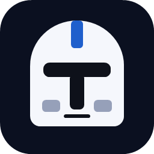
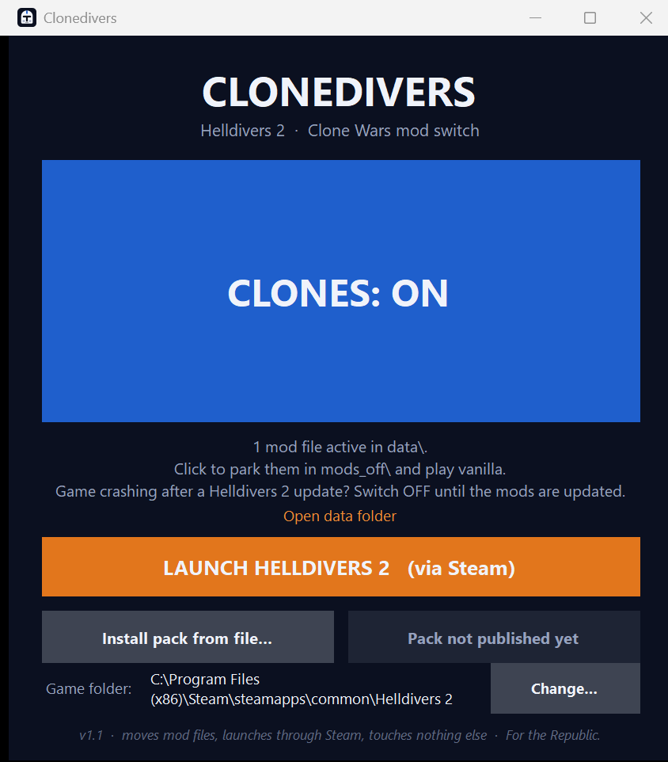
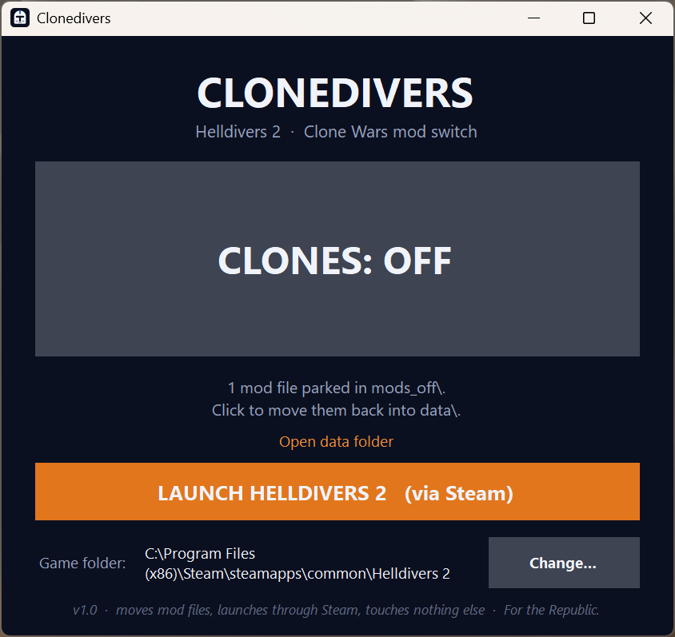

<p align="center"></p>

# Clonedivers

**Download one exe, click one button, and Helldivers 2 becomes the Clone Wars.**
Clonedivers installs the mod pack, switches it on or off, and launches the game. No installer, no accounts,
no background service, nothing touches the game itself.

<p align="center">
  <a href="https://github.com/owendavidgoode/clonedivers/releases/latest/download/Clonedivers.exe"><b>⬇ Download Clonedivers.exe</b></a>
  &nbsp;·&nbsp; Windows 10/11 64-bit, Steam copy of Helldivers 2. Nothing else to install.
</p>

<p align="center">
  
  
</p>

## Quick start (friends, this is the part to read)

1. **Download** `Clonedivers.exe` from the link above. Put it anywhere — Desktop is fine.
2. **Run it.** Windows shows *"Windows protected your PC"* because the exe isn't code-signed.
   Click **More info → Run anyway**. You see this once. (It's a plain .NET app; source is right here.)
3. It finds Helldivers 2 through Steam by itself. If it can't, it asks you to pick the game folder.
   Not sure where that is? In Steam: right-click Helldivers 2 → **Manage → Browse local files**. That window is the folder.
4. Click **Download pack**. It fetches Owen's pack (about 5 GB, so go make a coffee), checks it, and puts the files where
   the game reads them. If the download gets interrupted, click again and it resumes.
   Got the pack as a zip from Owen instead? Click **Install pack from file…** and pick it.
5. The big button now says **CLONES: ON**. Hit **LAUNCH HELLDIVERS 2**. Steam starts the game as normal.
6. Fancy a vanilla night? Close the game, click the big button so it reads **CLONES: OFF**, launch.
   Nothing is deleted — the files are parked in `Helldivers 2\mods_off\` until you flip it back.
7. When Owen ships a new pack, the button changes to **Update pack**. Click it. Old files it replaces go to
   `Helldivers 2\mods_old\`, which you can delete whenever you like.

**Golden rule: only flip the switch while the game is closed.** Helldivers 2 reads mods once, at startup.
Clonedivers refuses to toggle or install while `helldivers2.exe` is running and tells you why.

Optional: if your framerate tanks in the ship (Clone Armory is heavy), add `--use-d3d11` to the game's launch options
(Steam → right-click Helldivers 2 → Properties → Launch Options). 16 GB of RAM is the comfortable minimum for the full pack.

## What's in the pack

The pack is a stack of community mods from Nexus Mods, all client-side asset swaps, chosen and checked against the
live Nexus pages on **2026-09-05** (game patch 7.0.2). The full per-mod audit with dates and evidence is in
[docs/MODS.md](docs/MODS.md). Every one of these is somebody's work; the links are their pages.

| Layer | Mod | What it changes |
|---|---|---|
| Armor | [Star Wars – Clone Armory](https://www.nexusmods.com/helldivers2/mods/13956) | Every armor set → clone armor, plus backpacks, accessories, Republic decals. Beta, 2.8 GB, 1500+ files. |
| Weapons | [Star Wars Clone Blasters](https://www.nexusmods.com/helldivers2/mods/6633) | Nearly every weapon model → DC-15A/S, DC-17, Z-6, bowcaster… |
| Tracers | [Blue Overhaul – Laser Bolts](https://www.nexusmods.com/helldivers2/mods/4835) | Bullets → blaster bolts, turbolaser orbitals. Without this the blasters still fire bullets. |
| Weapon sounds | [Star Wars PEW-PEW sounds](https://www.nexusmods.com/helldivers2/mods/4891) | All weapon fire and reload → blaster sounds (Republic set). |
| Your voice | [Full Clone Voice Conversion](https://www.nexusmods.com/helldivers2/mods/11826) | All four Helldiver voices → clone trooper lines. |
| Radio voices | [RiqCrow's sound & voice library](https://www.nexusmods.com/helldivers2/mods/633) | Mission Control, Democracy Officer, clone officers, SEAF squad audio (Star Wars modules). |
| Allies | [SEAF Clone NPCs 2.0](https://www.nexusmods.com/helldivers2/mods/5251) | The SEAF soldiers you rescue → clone troopers. |
| Enemies | [Automaton → CIS Overhaul](https://www.nexusmods.com/helldivers2/mods/9115) | The whole Automaton faction → B1/B2 droids, MagnaGuards, AATs, MTTs, Vulture droids. Has open crash reports on 7.0; if a friend crashes on mission load, this is the first suspect. |
| Ship | [Venator over Super Destroyer](https://www.nexusmods.com/helldivers2/mods/6490) | Your Super Destroyer and the fleet → Venator-class. |
| Extraction | [LAAT Gunship over Pelican-1](https://www.nexusmods.com/helldivers2/mods/5778) | Pelican-1 → LAAT/i with Republic livery and Battlefront audio. |
| Eagle | [Y-Wing over Eagle-1](https://www.nexusmods.com/helldivers2/mods/12381) | Eagle-1 → Clone Wars Y-Wing. |
| Vehicles | [AT-TE exosuits + LAAT/c](https://www.nexusmods.com/helldivers2/mods/6396) · [TX-130 FRV](https://www.nexusmods.com/helldivers2/mods/6015) | Exosuits → AT-TE, vehicle drops → LAAT/c, the car → TX-130 Saber tank. |
| Map and text | [Galactic Map Overhaul](https://www.nexusmods.com/helldivers2/mods/1489) | Planet names, faction icons, "Super Earth" → "The Republic", Automatons → Separatists. |
| Polish | [Clone Trooper Ranks](https://www.nexusmods.com/helldivers2/mods/14612) · [Clone Pilot Audio](https://www.nexusmods.com/helldivers2/mods/10667) · [RC stratagem beeps](https://www.nexusmods.com/helldivers2/mods/13942) · [Invisible Capes](https://www.nexusmods.com/helldivers2/mods/11657) · [GNK Hellbomb](https://www.nexusmods.com/helldivers2/mods/11333) · [Star Wars music](https://www.nexusmods.com/helldivers2/mods/15612) | Small touches. |

Play on the Automaton front for the full effect: the droid conversion only covers bots; Terminids and Illuminate stay
vanilla because no mods exist for them yet. Mods are client-side only, so everyone installs the pack to be in the same movie.

## For Owen: publishing the pack

Friends never touch Nexus or a mod manager. You do it once per pack version:

1. Download the mod zips from Nexus (the links above; Arsenal's one-click download or the plain "Manual download" both
   work, the zips just need to end up in `%LOCALAPPDATA%\hd2arsenal\temp`, your Downloads folder, or `dist\mods`).
   Then let the repo do the mod manager's job:

   ```bash
   powershell -ExecutionPolicy Bypass -File tools\deploy-mods.ps1 -DryRun
   powershell -ExecutionPolicy Bypass -File tools\deploy-mods.ps1
   ```

   [`pack-recipe.json`](pack-recipe.json) is the whole configuration: which zip, which option in every option group
   (Republic, Phase 2, 501st…), which toggles, and the load order (Galactic Map last). The script reads each zip's
   `manifest.json`, picks the folders the recipe asks for, numbers every patch set consecutively per archive in
   recipe order (preserving each mod's own base-then-textures order), and writes them into `data\`. The dry run lists
   the plan and flags any zip that is missing or still downloading. Existing mod files are moved to `mods_old\`, never deleted.
   Clonedivers should then say **CLONES: ON**; launch once and check a bot mission before publishing.
2. Run one command from the repo folder:

   ```bash
   powershell -ExecutionPolicy Bypass -File tools\publish-pack.ps1 -Notes "Built for Helldivers 2 patch 7.0.2"
   ```

   It zips `data\`'s patch files (stored, not compressed, so it runs at disk speed), splits into parts under GitHub's
   2 GB asset limit, uploads them to a release named `pack-<date>` on this repo, writes the URLs, sizes and SHA-256
   hashes into `pack.json`, commits, and pushes. It warns if any archive has a gap in its patch numbers, the classic
   "half my mods vanished" mistake. Friends' Clonedivers reads `pack.json` on startup (through the GitHub API, so a fresh push
   shows up immediately) and offers **Download pack**, or **Update pack** when the version changed. Tested end to end with a
   dummy pack; the whole round trip took under a minute.

   It finds the GitHub CLI on PATH or in `%LOCALAPPDATA%\Programs\gh-cli`, and uses the login Git already has for github.com.

Hosting elsewhere: the app accepts any **direct** download URL in `pack.json`, so if you'd rather not keep the pack on the public
repo, run `tools\build-pack.ps1 -Url https://…` instead and host the zip yourself.

- **Cloudflare R2**: free tier is 10 GB with no egress charges, so the whole squad downloading 5 GB costs nothing. Make the
  bucket public with an unguessable object name, or put a Worker in front that checks a secret in the URL. Note the dashboard
  uploader stops at 300 MB; use `rclone` or another S3 client for a 5 GB file.
- **Cloudflare Pages does not work**: 25 MB per-file limit, and a private (Access-protected) site serves a login page the
  downloader can't get past.
- **Google Drive / OneDrive share links do not work in-app** (they open a web page). They're fine for friends to download in a
  browser and then use **Install pack from file…**.

Updating: deploy the new set, run `publish-pack.ps1` again. Clonedivers compares the version and shows **Update pack**. Files the
new pack no longer contains are parked in `mods_old\`; files with the same name are overwritten.

## What it does

- **ON** = your `*.patch_*` files sit in `Helldivers 2\data\`. **OFF** = the same files sit in `Helldivers 2\mods_off\`.
  The state is read from disk every time — nothing is stored, so it can't get out of sync.
- Moving is a rename on the same drive, so a multi-gigabyte pack flips instantly. Nothing is ever copied or deleted.
- **Download pack** reads `pack.json` from this repo, downloads the zip(s) into `Helldivers 2\mods_download\` with resume,
  refuses anything whose size or SHA-256 doesn't match, extracts only `*.patch_*` files flat into `data\`, parks anything
  stale in `mods_old\`, and deletes the zips. **Install pack from file…** does the same from a zip you already have.
- **Launch** opens `steam://rungameid/553850`, exactly like pressing Play in Steam. The game needs Steam running anyway
  (Steamworks + GameGuard), so this is the reliable way in.
- Finds the game via Steam's registry key and `libraryfolders.vdf`, so second-drive libraries work.
  A manually chosen folder and the installed pack version are remembered in `%APPDATA%\Clonedivers\config.json`.

## What it deliberately does not do

- It never injects into, hooks, reads, or otherwise touches the game process. It notices whether `helldivers2.exe`
  is running (to refuse a toggle or install) and that is all.
- No Nexus login, no mod browsing, no per-mod toggles, no patch-number management. The only thing it ever downloads is
  the pack listed in `pack.json`, verified by hash. All `*.patch_*` files move together.
- It doesn't edit any game file. Vanilla Helldivers 2 ships zero `*.patch_*` files, which is exactly why that pattern
  identifies mods safely.

## Gotchas

- **After a Helldivers 2 update, turn clones OFF until Owen ships an updated pack.** Asset mods are tied to the game's
  archives. Stale ones crash on launch (error `0x44415441`) or show broken gear. Steam's updater leaves the patch files
  alone, so Clonedivers will still say ON.
- **SmartScreen / antivirus.** The exe is unsigned and self-contained (the .NET runtime is packed inside), which trips
  Defender's "unrecognized app" screen and occasionally a false positive. Build it yourself if that bothers you.
- **Disk space.** Installing needs roughly twice the pack size free on the game drive while it runs (zip plus extracted
  files). The zip is deleted afterwards. `mods_old\` can be deleted any time.
- **Steam "Verify integrity of game files"** does not remove mods — it only repairs vanilla files. A full reinstall does
  wipe `data\`. `mods_off\` and `mods_old\` are sibling folders, so they survive both.
- **Anti-cheat.** Modding is technically against the EULA and "at your own risk." Arrowhead has not banned for
  cosmetic client-side mods; anything that changes gameplay is a different story. Clonedivers only moves files.
- **"Game not found."** Pick the folder containing `data\` and `bin\helldivers2.exe`. Clicked one level too deep
  (into `data` or `bin`)? It works that out.
- **"Couldn't move … file".** Something has the file open — antivirus mid-scan, a download still finishing, or the game.
  The other files still moved; once it's free, flip off and on again and the straggler catches up.
- **"That is a mod's options package, not a deployed pack."** The zip has the same file name under several folders, which
  is how Nexus mods with options are shipped. The pack must be built from a deployed `data\` folder (see above).
- **"Helldivers 2 is running" but no game window.** The game crashed and left `helldivers2.exe` behind.
  End it in Task Manager (Ctrl+Shift+Esc), then toggle.
- **Steam closed when you hit Launch.** Steam opens first, then the game. The button says *STARTING VIA STEAM…* meanwhile.

## Build it yourself

Needs the [.NET 8 SDK](https://dotnet.microsoft.com/download/dotnet/8.0). From the repo root:

```bash
dotnet publish -c Release Clonedivers
```

That drops a single self-contained `dist\Clonedivers.exe` (~63 MB, no runtime install needed on the target PC).

Native tests (plain console app, no test framework, exit code 0 = pass):

```bash
dotnet run --project Clonedivers.Tests
```

They prove the matcher moves exactly the patch files and their companions, leaves base archives and a decoy named
`game.patch` alone, overwrites a stale (even read-only) collision, round-trips cleanly, keeps going past a locked file and
names it, unescapes `libraryfolders.vdf` paths, extracts only patch files from a pack zip (flat, rejecting options packages),
parks stale files on install, and downloads with resume, rejecting hash or size mismatches and web pages served as files.

Layout: [`Clonedivers/Program.cs`](Clonedivers/Program.cs) is the whole app (C#, .NET 8 WinForms, one file).
[`tools/build-pack.ps1`](tools/build-pack.ps1) builds the pack and `pack.json`. [`tools/make-icon.ps1`](tools/make-icon.ps1)
regenerates the helmet icon. [`docs/MODS.md`](docs/MODS.md) is the mod audit.

## Preflight checklist

Run before shipping a new build, on a PC with the game installed. Use a dummy `test.patch_0` in `data\`
(no real mods needed) and delete it afterwards.

- [ ] App launches, finds the game with no prompt, shows **CLONES: ON**
- [ ] Toggle → file lands in `mods_off\`, `data\` has no `*.patch_*`, shows **CLONES: OFF**; toggle back
- [ ] **Launch** hands off to Steam
- [ ] With the game running, toggle and install are refused with a clear message
- [ ] With the game folder temporarily renamed, app shows **GAME NOT FOUND** and the picker recovers it (restore the folder)
- [ ] **Install pack from file…** with a small test zip: files land flat in `data\`, non-pack files go to `mods_old\`, ends ON
- [ ] With `pack.json` published: **Download pack** shows the version and size, downloads with progress, verifies, installs
- [ ] Renders cleanly at 100% and 150% display scaling

## License

MIT for Clonedivers itself. The mods in the pack belong to their authors on Nexus Mods; the pack is shared privately among
friends. Helldivers 2 is Arrowhead Game Studios / Sony Interactive Entertainment. Star Wars is Lucasfilm.
Fan utility, not affiliated with any of them.
